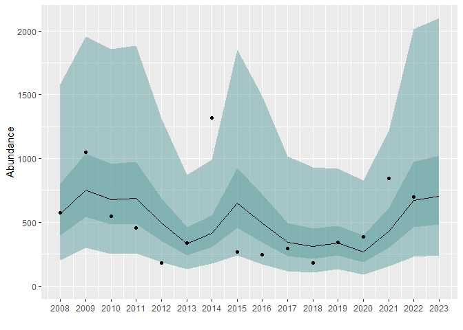
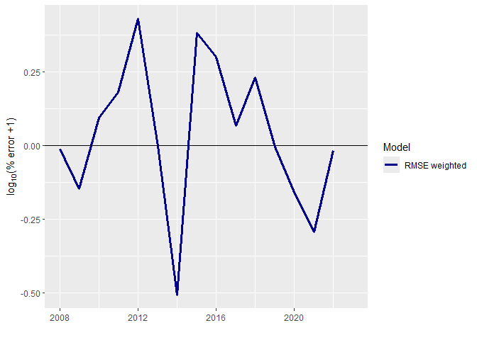

<!-- README.md is generated from README.Rmd. Please edit that file -->

# SalmonForecasting

<!-- badges: start -->

<!-- badges: end -->

The goal of SalmonForecasting is to make predictions of salmon returns
for an upcoming year based on estimates of salmon returns in previous
years and sets of predictors. The approach is to construct many ARIMA
models with different subsets of predictors and generate ensembles. The
ensembles are constructed by first evaluating the performance of each
candidate model in a series of retrospective one-year-ahead predictions,
then using the performance measures to select and weight predictions
from candidate models.

## Installation

You can install the development version of SalmonForecasting from
[GitHub](https://github.com/wdfw-fp/salmonforecast) with:

``` r
# install.packages("devtools")
devtools::install_github("wdfw-fp/salmonforecast")
```

## Example

Forecasts can be generated using the `do_forecast()` function, as shown
below with a coho salmon dataset included in the package as an example.
In this example, we include 11 different predictors, which include jack
returns, smolt abundances, and ocean-environment indicators. This
function can take some time depending on the total number of candidate
models.

``` r
library(SalmonForecasting)

head(dat)
#>   year species period abundance lag1_log_JackOPI lag1_log_SmAdj    lag1_NPGO
#> 1 1970    Coho      1    2765.1         5.088830      0.0000000 -0.387628509
#> 2 1971    Coho      1    3365.0         5.189618      0.0000000  0.061043154
#> 3 1972    Coho      1    1924.8         4.641502      0.0000000  0.381984271
#> 4 1973    Coho      1    1817.0         4.515245      0.2679443 -0.659303726
#> 5 1974    Coho      1    3071.1         4.970508      0.4968465  0.126585564
#> 6 1975    Coho      1    1652.8         4.333361      0.2786336 -0.009310217
#>        lag1_PDO     WSST_A  PDO.MJJ MEI.OND UWI.JAS SST.AMJ  SSH.AMJ UWI.SON
#> 1 -8.333333e-05  0.2125404 -0.24700   0.355  34.699  11.974  -38.467 -34.010
#> 2 -1.174167e-01 -0.8014592 -0.33025  -1.305  41.414  10.884 -153.033 -31.811
#> 3 -9.721667e-01 -1.1353811 -0.49775  -1.590  28.958  11.685  -71.833 -16.047
#> 4 -7.555000e-01 -1.0541626 -0.82425   1.440  33.791  11.854  -64.733  -8.150
#> 5 -6.501667e-01 -0.7638243 -1.08175  -1.800  41.151  12.245 -157.533 -19.501
#> 6 -7.425000e-02 -0.1969248 -1.04500  -1.370  33.195  10.935  -77.833  -8.792

forecast<-do_forecast(
  dat,
  covariates = c("lag1_log_JackOPI", "lag1_log_SmAdj", "lag1_NPGO", "lag1_PDO", "WSST_A",
    "PDO.MJJ", "MEI.OND", "UWI.JAS", "SST.AMJ", "SSH.AMJ", "UWI.SON"),
  TY_ensemble = 16,
  slide = 15,
  first_forecast_period = 1,
  plot_results = FALSE,
  write_model_summaries = TRUE,
  forecast_period_start_m = 1,
  forecast_period_start_d = 1,
  do_stacking = FALSE,
  stack_metric = "MAPE",
  k = 1,
  min_vars = 0,
  max_vars = 1,
  forecast_type = "preseason",
  num_models = 10,
  n_cores = 4,
  ts_freq = 1,
  seasonal = FALSE,
  exp_smooth_alpha = 0
)
#> [1] "There are 12 models to fit! Fitting model number:"
#> Time difference of 23.12802 secs
```

``` r
forecast$plots_and_tables$Table2
```

<table class=" lightable-classic" style="color: black; font-family: Cambria; width: auto !important; margin-left: auto; margin-right: auto;">

<caption>

Table 2. One step ahead individual and ensemble model performance
</caption>

<thead>

<tr>

<th style="text-align:right;">

MAPE
</th>

<th style="text-align:right;">

RMSE
</th>

<th style="text-align:right;">

MSA
</th>

<th style="text-align:right;">

MASE
</th>

<th style="text-align:left;">

Model
</th>

</tr>

</thead>

<tbody>

<tr>

<td style="text-align:right;">

67.17
</td>

<td style="text-align:right;">

313.68
</td>

<td style="text-align:right;">

74.80
</td>

<td style="text-align:right;">

0.85
</td>

<td style="text-align:left;">

Best individual
</td>

</tr>

<tr>

<td style="text-align:right;">

50.49
</td>

<td style="text-align:right;">

315.08
</td>

<td style="text-align:right;">

54.27
</td>

<td style="text-align:right;">

0.68
</td>

<td style="text-align:left;">

RMSE weighted
</td>

</tr>

<tr>

<td style="text-align:right;">

51.77
</td>

<td style="text-align:right;">

323.65
</td>

<td style="text-align:right;">

56.45
</td>

<td style="text-align:right;">

0.70
</td>

<td style="text-align:left;">

MSA weighted
</td>

</tr>

<tr>

<td style="text-align:right;">

52.79
</td>

<td style="text-align:right;">

328.06
</td>

<td style="text-align:right;">

58.01
</td>

<td style="text-align:right;">

0.71
</td>

<td style="text-align:left;">

MAPE weighted
</td>

</tr>

</tbody>

</table>

``` r
forecast$plots_and_tables$Table3
```

<table class=" lightable-classic" style="color: black; font-family: Cambria; width: auto !important; margin-left: auto; margin-right: auto;">

<caption>

Table 3. Individual models which performed the best inMAPE based on
a15year retrsopective analysis, and their forecasts.
</caption>

<thead>

<tr>

<th style="text-align:right;">

Year
</th>

<th style="text-align:left;">

Model
</th>

<th style="text-align:right;">

Predicted abundance
</th>

<th style="text-align:right;">

Lo 50
</th>

<th style="text-align:right;">

Hi 50
</th>

<th style="text-align:right;">

Lo 95
</th>

<th style="text-align:right;">

Hi 95
</th>

</tr>

</thead>

<tbody>

<tr>

<td style="text-align:right;">

2008
</td>

<td style="text-align:left;">

lag1_log_JackOPI
</td>

<td style="text-align:right;">

302.50
</td>

<td style="text-align:right;">

242.30
</td>

<td style="text-align:right;">

377.65
</td>

<td style="text-align:right;">

158.74
</td>

<td style="text-align:right;">

576.45
</td>

</tr>

<tr>

<td style="text-align:right;">

2009
</td>

<td style="text-align:left;">

lag1_log_SmAdj
</td>

<td style="text-align:right;">

650.22
</td>

<td style="text-align:right;">

463.48
</td>

<td style="text-align:right;">

912.20
</td>

<td style="text-align:right;">

243.12
</td>

<td style="text-align:right;">

1739.02
</td>

</tr>

<tr>

<td style="text-align:right;">

2010
</td>

<td style="text-align:left;">

UWI.SON
</td>

<td style="text-align:right;">

827.24
</td>

<td style="text-align:right;">

562.26
</td>

<td style="text-align:right;">

1217.11
</td>

<td style="text-align:right;">

269.36
</td>

<td style="text-align:right;">

2540.56
</td>

</tr>

<tr>

<td style="text-align:right;">

2011
</td>

<td style="text-align:left;">

lag1_NPGO
</td>

<td style="text-align:right;">

803.54
</td>

<td style="text-align:right;">

560.82
</td>

<td style="text-align:right;">

1151.30
</td>

<td style="text-align:right;">

282.60
</td>

<td style="text-align:right;">

2284.78
</td>

</tr>

<tr>

<td style="text-align:right;">

2012
</td>

<td style="text-align:left;">

lag1_log_JackOPI
</td>

<td style="text-align:right;">

352.12
</td>

<td style="text-align:right;">

282.20
</td>

<td style="text-align:right;">

439.37
</td>

<td style="text-align:right;">

185.07
</td>

<td style="text-align:right;">

669.97
</td>

</tr>

<tr>

<td style="text-align:right;">

2013
</td>

<td style="text-align:left;">

lag1_log_JackOPI
</td>

<td style="text-align:right;">

503.21
</td>

<td style="text-align:right;">

400.27
</td>

<td style="text-align:right;">

632.64
</td>

<td style="text-align:right;">

258.76
</td>

<td style="text-align:right;">

978.59
</td>

</tr>

<tr>

<td style="text-align:right;">

2014
</td>

<td style="text-align:left;">

lag1_log_JackOPI
</td>

<td style="text-align:right;">

986.32
</td>

<td style="text-align:right;">

783.69
</td>

<td style="text-align:right;">

1241.35
</td>

<td style="text-align:right;">

505.59
</td>

<td style="text-align:right;">

1924.16
</td>

</tr>

<tr>

<td style="text-align:right;">

2015
</td>

<td style="text-align:left;">

lag1_log_JackOPI
</td>

<td style="text-align:right;">

760.15
</td>

<td style="text-align:right;">

604.48
</td>

<td style="text-align:right;">

955.92
</td>

<td style="text-align:right;">

390.59
</td>

<td style="text-align:right;">

1479.40
</td>

</tr>

<tr>

<td style="text-align:right;">

2016
</td>

<td style="text-align:left;">

lag1_log_JackOPI
</td>

<td style="text-align:right;">

360.50
</td>

<td style="text-align:right;">

280.78
</td>

<td style="text-align:right;">

462.85
</td>

<td style="text-align:right;">

174.39
</td>

<td style="text-align:right;">

745.24
</td>

</tr>

<tr>

<td style="text-align:right;">

2017
</td>

<td style="text-align:left;">

lag1_log_JackOPI
</td>

<td style="text-align:right;">

417.04
</td>

<td style="text-align:right;">

324.84
</td>

<td style="text-align:right;">

535.42
</td>

<td style="text-align:right;">

201.77
</td>

<td style="text-align:right;">

862.01
</td>

</tr>

<tr>

<td style="text-align:right;">

2018
</td>

<td style="text-align:left;">

lag1_log_JackOPI
</td>

<td style="text-align:right;">

342.75
</td>

<td style="text-align:right;">

267.05
</td>

<td style="text-align:right;">

439.92
</td>

<td style="text-align:right;">

165.96
</td>

<td style="text-align:right;">

707.87
</td>

</tr>

<tr>

<td style="text-align:right;">

2019
</td>

<td style="text-align:left;">

lag1_log_JackOPI
</td>

<td style="text-align:right;">

874.73
</td>

<td style="text-align:right;">

678.29
</td>

<td style="text-align:right;">

1128.05
</td>

<td style="text-align:right;">

417.73
</td>

<td style="text-align:right;">

1831.67
</td>

</tr>

<tr>

<td style="text-align:right;">

2020
</td>

<td style="text-align:left;">

lag1_NPGO
</td>

<td style="text-align:right;">

216.86
</td>

<td style="text-align:right;">

146.37
</td>

<td style="text-align:right;">

321.28
</td>

<td style="text-align:right;">

69.20
</td>

<td style="text-align:right;">

679.58
</td>

</tr>

<tr>

<td style="text-align:right;">

2021
</td>

<td style="text-align:left;">

WSST_A
</td>

<td style="text-align:right;">

329.44
</td>

<td style="text-align:right;">

228.36
</td>

<td style="text-align:right;">

475.25
</td>

<td style="text-align:right;">

113.58
</td>

<td style="text-align:right;">

955.52
</td>

</tr>

<tr>

<td style="text-align:right;">

2022
</td>

<td style="text-align:left;">

WSST_A
</td>

<td style="text-align:right;">

735.67
</td>

<td style="text-align:right;">

506.21
</td>

<td style="text-align:right;">

1069.13
</td>

<td style="text-align:right;">

248.27
</td>

<td style="text-align:right;">

2179.94
</td>

</tr>

<tr>

<td style="text-align:right;">

2023
</td>

<td style="text-align:left;">

WSST_A
</td>

<td style="text-align:right;">

808.37
</td>

<td style="text-align:right;">

558.36
</td>

<td style="text-align:right;">

1170.32
</td>

<td style="text-align:right;">

275.84
</td>

<td style="text-align:right;">

2369.00
</td>

</tr>

</tbody>

</table>

``` r
forecast$plots_and_tables$Table4
```

<table class=" lightable-classic" style="color: black; font-family: Cambria; width: auto !important; margin-left: auto; margin-right: auto;">

<caption>

Table 4. One-year-ahead forecasts based on the RMSE_weighted model.
</caption>

<thead>

<tr>

<th style="text-align:right;">

Year
</th>

<th style="text-align:left;">

Model
</th>

<th style="text-align:right;">

Abundance
</th>

<th style="text-align:right;">

Predicted abundance
</th>

<th style="text-align:right;">

Lo 50
</th>

<th style="text-align:right;">

Hi 50
</th>

<th style="text-align:right;">

Lo 95
</th>

<th style="text-align:right;">

Hi 95
</th>

<th style="text-align:right;">

error
</th>

<th style="text-align:right;">

% error
</th>

</tr>

</thead>

<tbody>

<tr>

<td style="text-align:right;">

2008
</td>

<td style="text-align:left;">

RMSE_weighted
</td>

<td style="text-align:right;">

576.9
</td>

<td style="text-align:right;">

562.03
</td>

<td style="text-align:right;">

395.20
</td>

<td style="text-align:right;">

800.96
</td>

<td style="text-align:right;">

203.32
</td>

<td style="text-align:right;">

1581.29
</td>

<td style="text-align:right;">

-14.87
</td>

<td style="text-align:right;">

-0.03
</td>

</tr>

<tr>

<td style="text-align:right;">

2009
</td>

<td style="text-align:left;">

RMSE_weighted
</td>

<td style="text-align:right;">

1051.0
</td>

<td style="text-align:right;">

749.82
</td>

<td style="text-align:right;">

543.14
</td>

<td style="text-align:right;">

1039.12
</td>

<td style="text-align:right;">

297.08
</td>

<td style="text-align:right;">

1954.41
</td>

<td style="text-align:right;">

-301.18
</td>

<td style="text-align:right;">

-0.29
</td>

</tr>

<tr>

<td style="text-align:right;">

2010
</td>

<td style="text-align:left;">

RMSE_weighted
</td>

<td style="text-align:right;">

546.5
</td>

<td style="text-align:right;">

678.21
</td>

<td style="text-align:right;">

481.71
</td>

<td style="text-align:right;">

957.09
</td>

<td style="text-align:right;">

252.77
</td>

<td style="text-align:right;">

1855.93
</td>

<td style="text-align:right;">

131.71
</td>

<td style="text-align:right;">

0.24
</td>

</tr>

<tr>

<td style="text-align:right;">

2011
</td>

<td style="text-align:left;">

RMSE_weighted
</td>

<td style="text-align:right;">

454.2
</td>

<td style="text-align:right;">

688.24
</td>

<td style="text-align:right;">

488.76
</td>

<td style="text-align:right;">

971.32
</td>

<td style="text-align:right;">

256.34
</td>

<td style="text-align:right;">

1883.25
</td>

<td style="text-align:right;">

234.04
</td>

<td style="text-align:right;">

0.52
</td>

</tr>

<tr>

<td style="text-align:right;">

2012
</td>

<td style="text-align:left;">

RMSE_weighted
</td>

<td style="text-align:right;">

183.1
</td>

<td style="text-align:right;">

491.88
</td>

<td style="text-align:right;">

352.65
</td>

<td style="text-align:right;">

687.84
</td>

<td style="text-align:right;">

188.49
</td>

<td style="text-align:right;">

1311.63
</td>

<td style="text-align:right;">

308.78
</td>

<td style="text-align:right;">

1.69
</td>

</tr>

<tr>

<td style="text-align:right;">

2013
</td>

<td style="text-align:left;">

RMSE_weighted
</td>

<td style="text-align:right;">

335.1
</td>

<td style="text-align:right;">

333.75
</td>

<td style="text-align:right;">

242.05
</td>

<td style="text-align:right;">

462.31
</td>

<td style="text-align:right;">

132.99
</td>

<td style="text-align:right;">

870.66
</td>

<td style="text-align:right;">

-1.35
</td>

<td style="text-align:right;">

0.00
</td>

</tr>

<tr>

<td style="text-align:right;">

2014
</td>

<td style="text-align:left;">

RMSE_weighted
</td>

<td style="text-align:right;">

1316.5
</td>

<td style="text-align:right;">

410.75
</td>

<td style="text-align:right;">

306.16
</td>

<td style="text-align:right;">

553.68
</td>

<td style="text-align:right;">

177.14
</td>

<td style="text-align:right;">

991.13
</td>

<td style="text-align:right;">

-905.75
</td>

<td style="text-align:right;">

-0.69
</td>

</tr>

<tr>

<td style="text-align:right;">

2015
</td>

<td style="text-align:left;">

RMSE_weighted
</td>

<td style="text-align:right;">

268.9
</td>

<td style="text-align:right;">

648.39
</td>

<td style="text-align:right;">

456.78
</td>

<td style="text-align:right;">

926.00
</td>

<td style="text-align:right;">

238.63
</td>

<td style="text-align:right;">

1854.40
</td>

<td style="text-align:right;">

379.49
</td>

<td style="text-align:right;">

1.41
</td>

</tr>

<tr>

<td style="text-align:right;">

2016
</td>

<td style="text-align:left;">

RMSE_weighted
</td>

<td style="text-align:right;">

247.7
</td>

<td style="text-align:right;">

495.24
</td>

<td style="text-align:right;">

340.76
</td>

<td style="text-align:right;">

722.03
</td>

<td style="text-align:right;">

168.75
</td>

<td style="text-align:right;">

1493.06
</td>

<td style="text-align:right;">

247.54
</td>

<td style="text-align:right;">

1.00
</td>

</tr>

<tr>

<td style="text-align:right;">

2017
</td>

<td style="text-align:left;">

RMSE_weighted
</td>

<td style="text-align:right;">

291.8
</td>

<td style="text-align:right;">

341.16
</td>

<td style="text-align:right;">

236.13
</td>

<td style="text-align:right;">

495.01
</td>

<td style="text-align:right;">

118.62
</td>

<td style="text-align:right;">

1016.85
</td>

<td style="text-align:right;">

49.36
</td>

<td style="text-align:right;">

0.17
</td>

</tr>

<tr>

<td style="text-align:right;">

2018
</td>

<td style="text-align:left;">

RMSE_weighted
</td>

<td style="text-align:right;">

182.8
</td>

<td style="text-align:right;">

311.24
</td>

<td style="text-align:right;">

215.06
</td>

<td style="text-align:right;">

452.12
</td>

<td style="text-align:right;">

107.54
</td>

<td style="text-align:right;">

929.68
</td>

<td style="text-align:right;">

128.44
</td>

<td style="text-align:right;">

0.70
</td>

</tr>

<tr>

<td style="text-align:right;">

2019
</td>

<td style="text-align:left;">

RMSE_weighted
</td>

<td style="text-align:right;">

340.7
</td>

<td style="text-align:right;">

337.65
</td>

<td style="text-align:right;">

241.92
</td>

<td style="text-align:right;">

473.78
</td>

<td style="text-align:right;">

130.09
</td>

<td style="text-align:right;">

916.74
</td>

<td style="text-align:right;">

-3.05
</td>

<td style="text-align:right;">

-0.01
</td>

</tr>

<tr>

<td style="text-align:right;">

2020
</td>

<td style="text-align:left;">

RMSE_weighted
</td>

<td style="text-align:right;">

387.7
</td>

<td style="text-align:right;">

269.57
</td>

<td style="text-align:right;">

183.85
</td>

<td style="text-align:right;">

396.07
</td>

<td style="text-align:right;">

89.25
</td>

<td style="text-align:right;">

828.71
</td>

<td style="text-align:right;">

-118.13
</td>

<td style="text-align:right;">

-0.30
</td>

</tr>

<tr>

<td style="text-align:right;">

2021
</td>

<td style="text-align:left;">

RMSE_weighted
</td>

<td style="text-align:right;">

841.3
</td>

<td style="text-align:right;">

427.23
</td>

<td style="text-align:right;">

300.23
</td>

<td style="text-align:right;">

610.18
</td>

<td style="text-align:right;">

154.93
</td>

<td style="text-align:right;">

1215.03
</td>

<td style="text-align:right;">

-414.07
</td>

<td style="text-align:right;">

-0.49
</td>

</tr>

<tr>

<td style="text-align:right;">

2022
</td>

<td style="text-align:left;">

RMSE_weighted
</td>

<td style="text-align:right;">

696.0
</td>

<td style="text-align:right;">

669.24
</td>

<td style="text-align:right;">

460.71
</td>

<td style="text-align:right;">

975.20
</td>

<td style="text-align:right;">

228.33
</td>

<td style="text-align:right;">

2013.91
</td>

<td style="text-align:right;">

-26.76
</td>

<td style="text-align:right;">

-0.04
</td>

</tr>

<tr>

<td style="text-align:right;">

2023
</td>

<td style="text-align:left;">

RMSE_weighted
</td>

<td style="text-align:right;">

NA
</td>

<td style="text-align:right;">

702.65
</td>

<td style="text-align:right;">

484.86
</td>

<td style="text-align:right;">

1021.34
</td>

<td style="text-align:right;">

241.30
</td>

<td style="text-align:right;">

2098.62
</td>

<td style="text-align:right;">

NA
</td>

<td style="text-align:right;">

NA
</td>

</tr>

</tbody>

</table>

``` r
forecast$plots_and_tables$Figure1
```



``` r
forecast$plots_and_tables$Figure3
```


